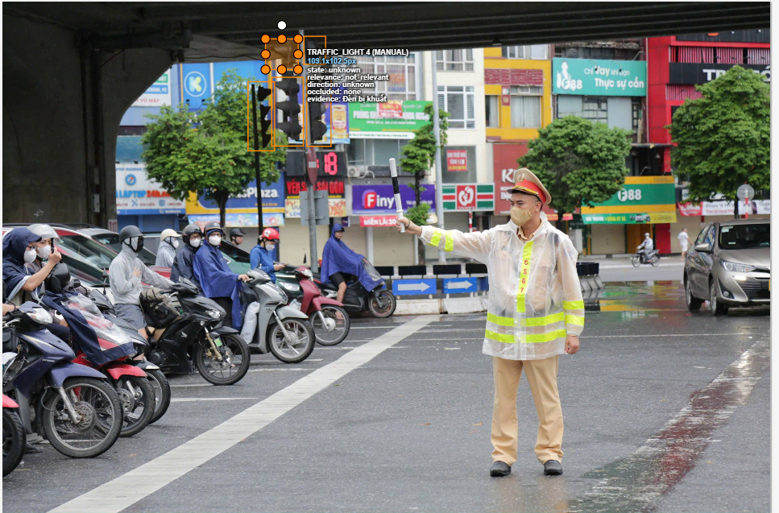
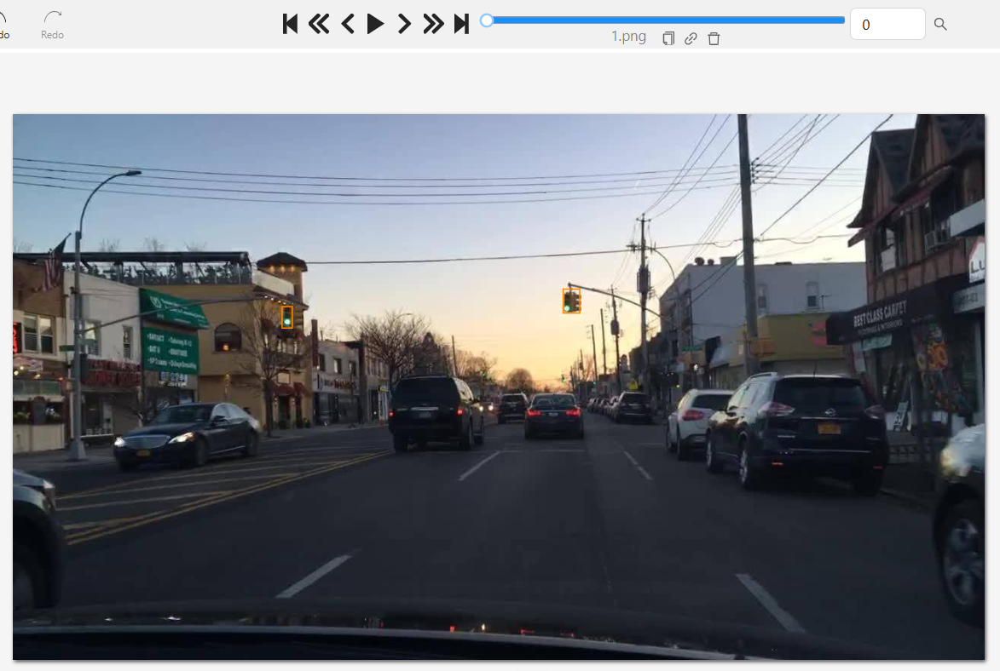
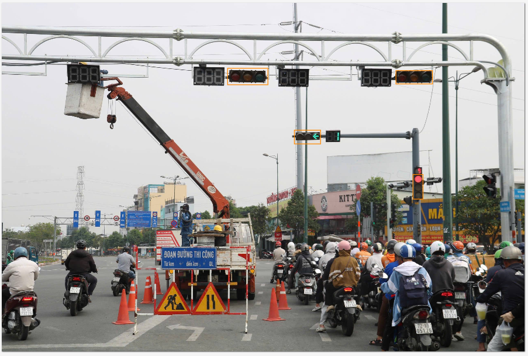
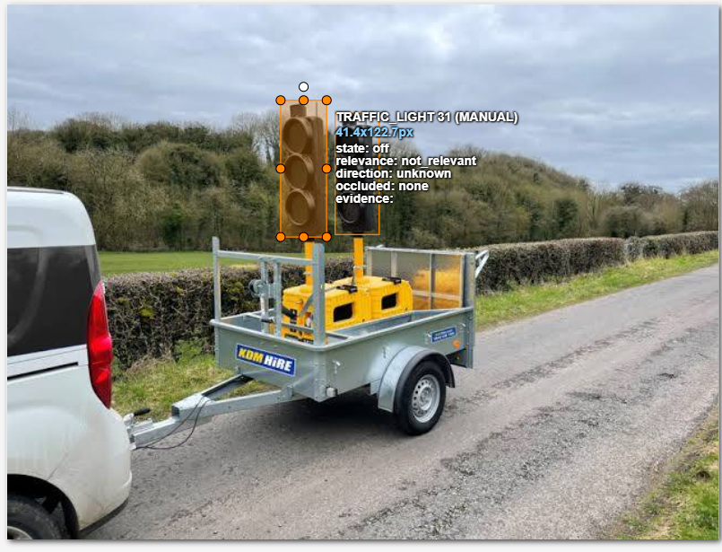
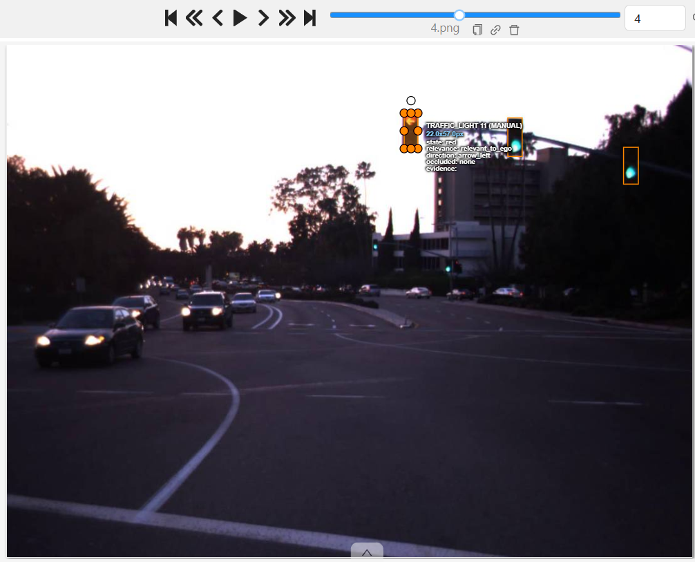

# Guideline — Traffic Light Annotation

**Version:** v2

<!--
v2 hiện tại. Đổi dòng Version thành v3 sau blind handoff (mục 7 README); mỗi lần tăng version ghi một dòng vào
08_revision_log.md. `make freeze` đòi v2 trở lên; nộp cuối đòi v3.

File này là thứ nhóm peer nhận nguyên văn trong blind pack và là Guide dán vào CVAT. Peer KHÔNG nhận
edge_case_cards.md, gold_decisions.csv hay sample_pack.csv. Rule nào peer cần biết phải nằm ở đây.
No hidden rules: rule chỉ giải thích bằng miệng thì coi như không tồn tại.
-->

**Chủ đề:** Traffic Light | **Hình học CVAT:** Rectangle (Track nếu là video/sequence)
**Nguồn dữ liệu tham chiếu:** DriveU Traffic Light Dataset (DTLD) — hơn 230k annotation, bbox + attribute (relevance, state, orientation, pictogram, occlusion) + track identity. Giấy phép: đăng ký tại Ulm University, chỉ dùng nghiên cứu/giảng dạy, **cấm thương mại, cấm chia sẻ cho bên thứ ba** — mỗi người tự tải theo quyền của mình, không re-host DTLD trong repo lớp. Nguồn thay thế: Bosch Small Traffic Lights (đèn nhỏ/xa, chiếu sáng khó), BDD100K (`trafficLightColor`), dashcam tự quay (đã làm mờ mặt người/biển số).

> **Không có rule ngầm.** File này là văn bản duy nhất nhóm chấm chéo sẽ nhận được, không kèm giải thích bằng miệng. Một quyết định không nằm trong file này hoặc trong `04_edge_cases/edge_case_cards.md` (dùng làm ví dụ) thì coi như không tồn tại.

> **Hai nguyên tắc tách bạch:** (1) Rule lấy trực tiếp từ dataset gốc (DTLD) khác với "quy ước lớp học" — ví dụ nhóm chọn `relevant_to_ego / not_relevant / unknown_relevance` thay vì bộ giá trị gốc của DTLD, quy ước này chỉ để đưa dữ liệu vào bài tập CVAT, không phải chuẩn chính thức của dataset (xem ghi chú tương thích ở mục 4). (2) Không so annotation của mình với ground truth trước khi nhóm khác làm xong bài test — GT giữ riêng trong `gt_reference/`, chỉ upload ảnh cho nhóm khác.

---

## 1. Mục đích và phạm vi

*(không đổi so với v1)* Nhãn traffic light phục vụ module nhận diện đèn cho ADAS/ego-vehicle perception — output tiêu thụ trực tiếp bởi driving policy để quyết định dừng/đi. Annotation phải trả lời được "đèn này có điều khiển xe của tôi không", không chỉ "đèn màu gì".

- **Trong phạm vi:** mọi đèn tín hiệu xe cơ giới nhìn thấy được, ở bất kỳ khoảng cách/góc nào, kể cả không áp dụng cho ego.
- **Ngoài phạm vi** (không tạo box — pilot-test đã cho thấy đây là chỗ hay nhầm nhất, xem mục 10):
  - Đèn người đi bộ/xe đạp — hình dạng icon người/xe đạp khác hẳn đèn tròn/mũi tên.
  - Đèn hậu xe (tail light) — dễ nhầm vào ban đêm vì cũng có màu đỏ sáng.
  - Phản chiếu đèn trên kính toà nhà, kính xe, hoặc biển quảng cáo LED — không có cột đèn vật lý tại vị trí đó.
  - Đèn đếm ngược hiển thị số giây — ngoài scope schema này.

## 2. Annotation unit

Đơn vị là **1 light head nhìn thấy được**. Một cột/gantry có N head (ví dụ 1 đèn tròn + 1 đèn mũi tên rẽ trái) → **N box riêng biệt**, mỗi box 1 head — **không gộp thành 1 box bao cả cụm** (pilot đã mắc đúng lỗi này, xem edge case EC-02).

## 3. Geometry rule

Box bao sát viền light head/lamp housing nhìn thấy được, không lấy cột/giá đỡ. Ảnh tĩnh: Rectangle (Shape). Video/sequence: Rectangle (Track) để giữ object identity; đặt keyframe mới khi box hoặc state đổi rõ rệt, sau đó dùng **Attribute Annotation Mode** trong CVAT để gán state/relevance nhanh cho cả chuỗi thay vì sửa từng frame một.

**Export format:** toàn bộ ảnh của project này là ảnh tĩnh, dùng **Shape** (không Track) — export task/job bằng **"CVAT for images 1.1"** (Actions → Export task dataset, hoặc trong job: Menu → Export job dataset), tắt "Save images". Không dùng "CVAT for video 1.1" vì format đó chỉ cần cho task có Track; dùng sai format khiến `make calib`/`make score` không đọc được ảnh trống hoặc báo lỗi thiếu `<image>`.

## 4. Taxonomy — class & attribute

Chỉ 1 class `traffic_light`. State/relevance/direction là attribute vì cùng object có thể đổi các giá trị này theo frame/góc nhìn — tách thành class riêng sẽ làm taxonomy nổ ra không cần thiết (mỗi tổ hợp màu × hướng × mức liên quan sẽ thành hàng chục class nếu tách sai).

**Ontology đầy đủ (phải khớp chính xác `03_ontology_and_cvat_setup.md`):**

| Name            | Geometry  | Class/Attribute        | Allowed values                                              | Default           | Mutable?             | Rationale                                                                                    |
| --------------- | --------- | ---------------------- | ----------------------------------------------------------- | ----------------- | -------------------- | -------------------------------------------------------------------------------------------- |
| `traffic_light` | Rectangle | Class                  | —                                                          | —                | —                   | Duy nhất 1 class, tránh nổ taxonomy                                                       |
| `state`         | —        | Attribute              | red / yellow / green / off / unknown                        | unknown           | Có                  | Đổi theo frame; downstream cần biết đèn đang "nói" gì                               |
| `relevance`     | —        | Attribute              | relevant_to_ego / not_relevant / unknown_relevance          | unknown_relevance | Có                  | Quyết định critical nhất — đèn có điều khiển ego không                           |
| `direction`     | —        | Attribute              | round / arrow_left / arrow_right / arrow_straight / unknown | unknown           | Ít đổi hơn state | Hình dạng lens quyết định ego được rẽ/đi thẳng theo tín hiệu nào               |
| `occluded`      | —        | Attribute              | none / partial / heavy                                      | none              | Có                  | Cờ mức độ che, phục vụ QC & ngưỡng escalate (mới ở v2)                             |
| `evidence`      | —        | Attribute (text ngắn) | tự do                                                      | ""                | Có                  | Bắt buộc điền khi`state`/`relevance` = unknown, để reviewer hiểu vì sao (mới ở v2) |

**Định nghĩa từng giá trị (giải thích dễ hiểu, để hai annotator hiểu giống nhau):**

- **`state`** — màu đang sáng đúng tại thời điểm chụp:
  - `red` / `yellow` / `green`: đèn đang sáng đúng màu đó (kể cả khi lens có hình mũi tên).
  - `off`: **chắc chắn** không có đèn nào trong 3 màu đang sáng — nhìn rõ cả các lens đều tối (đèn hỏng, đèn tạm
    chưa bật, đèn đang được tháo/vận chuyển...).
  - `unknown`: **không chắc** — có thể có đèn đang sáng nhưng không đọc được màu nào (quá xa, quá mờ, chói ngược
    sáng, bị che một phần khiến không thấy rõ lens đang sáng).
  - Cách phân biệt nhanh `off` vs `unknown`: nhìn rõ cả cụm đèn và thấy tối hết → `off`; không nhìn đủ rõ để kết
    luận → `unknown`.
- **`relevance`** — đèn này có áp dụng cho hướng/làn mà ego (xe gắn camera) đang đi hay không:
  - `relevant_to_ego`: đèn thực sự điều khiển làn/hướng ego đang di chuyển — sai ở đây là lỗi `critical`.
  - `not_relevant`: đèn thuộc hướng/làn khác (giao cắt, rẽ khác hướng, chiều ngược lại, lane khác) — ego không cần
    tuân theo, nhưng vẫn phải `LABEL`, không được bỏ qua (xem Scope ở `01_problem_statement.md`).
  - `unknown_relevance`: không đủ bằng chứng để xác định đèn phục vụ hướng nào (không rõ layout giao lộ, không rõ
    ego đang ở làn nào trong khung hình).
- **`direction`** — hình dạng lens của đèn (không phải hướng ego sẽ rẽ):
  - `round`: đèn tròn, áp dụng chung cho đi thẳng lẫn rẽ.
  - `arrow_left` / `arrow_right` / `arrow_straight`: đèn hình mũi tên, chỉ rõ đúng hướng rẽ/đi thẳng được phép.
  - `unknown`: không xác định được hình lens (quá nhỏ/xa/mờ để phân biệt tròn hay mũi tên).
- **`occluded`** — mức độ **vật khác** che khuất đèn (không tính trường hợp đèn bị cắt bởi mép khung hình — đó là
  truncation, xem mục 6):
  - `none`: nhìn thấy trọn vẹn lens.
  - `partial`: bị che **dưới 50%** diện tích — vẫn đọc được màu, gán `state` bình thường.
  - `heavy`: bị che **từ 50% trở lên** — không đọc chắc được màu nên `state=unknown` và ghi `evidence`. Nếu che từ 90%
    trở lên mà không xác định được cả vị trí chính xác của đèn thì ESCALATE (mục 6, 7).
- **`evidence`** — một câu ngắn giải thích vì sao gán `unknown`, ví dụ: "đèn cách xa, lens mờ do sương đêm" hoặc
  "bị xe tải che gần hết, chỉ thấy viền hộp đèn". Bắt buộc khi `state` hoặc `relevance` = unknown, để reviewer hiểu
  lý do thay vì nghi ngờ annotator làm ẩu.

**Ghi chú tương thích với DTLD:** bản gốc DTLD tách riêng `pictogram` (circle/arrow/pedestrian/bicycle…) với `orientation` (bố trí vật lý của đèn: vertical/horizontal), và dùng `relevant/not_relevant/unknown` cho relevance. Nhóm gộp `pictogram` vào attribute `direction` (round/arrow_*) vì bài này không cần phân biệt orientation vật lý, và đổi `relevant` → `relevant_to_ego` cho rõ nghĩa hơn với người đọc ngoài nhóm. Khi so với GT gốc DTLD: **không remap state trước** — đọc đúng vocabulary trong JSON v2 của DTLD (có cả state chuyển tiếp như `red-yellow`), chỉ map sang schema project này sau, bằng bảng mapping có ghi version.

## 5. Inclusion / exclusion

*(không đổi so với v1, chỉ thêm ví dụ cụ thể ở mục 9–10)* Không box: đèn người đi bộ/xe đạp, đèn hậu, phản chiếu, đèn đếm ngược. Có box: mọi đèn xe cơ giới nhìn thấy được kể cả không relevant cho ego (gán `not_relevant`, không phải bỏ qua).

**Đèn rất nhỏ/ở xa (mới, sau calibration):** xem ảnh ở 100%; nhận ra được vỏ đèn thì vẫn vẽ box, kể cả không đọc được màu — khi đó `state=unknown`, `direction=unknown` và ghi `evidence`. Chỉ bỏ qua khi đó là một chấm sáng không phân biệt được vỏ đèn. Calibration `TEAM05` cho thấy hai người đếm lệch nhau 2 đèn ở đúng chỗ này.

## 6. Visibility / occlusion

**Mới ở v2** — pilot cho thấy v1 thiếu ngưỡng số cụ thể, mỗi người tự đoán "che nhiều" khác nhau:

| Mức che | Hành động |
| ------------------------------------------------------ | --------------------------------------------------------------------------------------------------------------------------------------- |
| < 50% diện tích light head | Vẫn xác định màu bình thường; gán`occluded=partial` nếu có che dù nhẹ |
| 50–90% | `state=unknown`, `occluded=heavy`, ghi lý do vào `evidence` |
| ≥ 90% (chỉ còn thấy viền hộp, không thấy màu) | `state=unknown`, `occluded=heavy`; nếu không xác định được cả vị trí chính xác → **ESCALATE** thay vì tự vẽ box đoán |

Không dùng frame trước/sau để "bịa" ra màu của frame đang bị che — chỉ dùng context để xác nhận vị trí/identity của đèn, không để suy luận state.

## 7. Ambiguity / escalation

**Cây quyết định `relevance`** (làm đúng thứ tự, không nhảy bước — mới ở v2, đưa nguyên từ đề bài vào đây):

1. Đèn có nằm trong field of view và đủ rõ để phân tích không? Không đủ rõ → `unknown_relevance`.
2. Đèn thuộc road branch/lane group nào? Dựa vào vị trí ngang, mũi tên trên đèn, gantry, hình học của làn.
3. Ego lane/hướng đi của frame này là gì: đi thẳng, rẽ trái, rẽ phải, merge, hay service lane?
4. Đèn đó điều khiển ego lane hay đối tượng khác (pedestrian, bus, bicycle, cross street)? Nếu là đối tượng khác → `not_relevant`.
5. Nếu vẫn thiếu bằng chứng sau 4 bước trên → `unknown_relevance`, không đoán.

**Trường hợp đặc biệt — người điều khiển giao thông (mới, xem ảnh gốc `11.png` — cảnh sát điều khiển giao thông, chưa đưa vào `sample_pack.csv`):** nếu tại giao lộ có cảnh sát/người điều
khiển giao thông đang ra hiệu lệnh, đèn tín hiệu vẫn `LABEL` theo đúng `state` đang sáng (đèn vẫn là vật thể thật,
vẫn phải ghi nhận), nhưng luôn gán `relevance=not_relevant` **bất kể đèn có về mặt hình học điều khiển đúng lane
của ego hay không** — vì luật giao thông yêu cầu người lái ưu tiên tuân theo hiệu lệnh trực tiếp của người điều
khiển giao thông thay vì đèn. Đây là ngoại lệ duy nhất mà `relevance` không đi theo 5 bước decision tree ở trên.

4 loại quyết định và cách **bắt buộc** thể hiện trong CVAT export — quyết định nào không hiện trong export thì không chấm được:

| Quyết định | Ý nghĩa | Thể hiện trong CVAT |
| ------------- | -------------------------------------------------------------------------------- | --------------------------------------------------------------------------------------------------------------------------------------------- |
| **LABEL** | Đủ bằng chứng, gán bình thường | Box +`state`/`relevance`/`direction` cụ thể (không phải unknown) |
| **IGNORE** | Đối tượng ngoài scope (mục 1, 5) | Không tạo box — object không xuất hiện trong export |
| **UNKNOWN** | Có object thật, thiếu bằng chứng 1 attribute | Box vẫn có; attribute tương ứng =`unknown`/`unknown_relevance`; `evidence` ghi lý do |
| **ESCALATE** | Case guideline chưa lường trước (ví dụ dãy đèn liên tục trong hầm không tách được ranh giới từng head — xem `edge_case_cards.md` EC09) | Box tạm +`evidence` ghi rõ "ESCALATE: <lý do>" + 1 dòng trong decision log, chờ team lead quyết ở lần cập nhật guideline tiếp theo |

## 8. Temporal rule

State hợp lệ chuyển theo logic vật lý: `red→yellow→green` hoặc `green→yellow→red` (hoặc `red-yellow` nếu theo đúng vocab transition của DTLD). Nhảy bất thường (ví dụ đỏ → xanh không qua vàng ở frame kề) là **tín hiệu QC** cần xem lại, không tự sửa.

`relevance` không được "trôi" (drift) qua lại giữa các frame liền kề mà không có lý do hình học rõ ràng (ví dụ ego đổi làn) — nếu cùng 1 đèn lúc `relevant_to_ego` lúc `not_relevant` giữa 2 frame gần nhau, coi là lỗi tracking/rule, phải xem lại chứ không giữ nguyên.

`relevance` được định nghĩa theo **planned route hiện tại của ego** — đèn của giao lộ *kế tiếp* (nhìn xa hơn phía trước) không được đánh `relevant_to_ego` cho giao lộ đang xử lý.

Review theo cả chuỗi (sequence), không chấm từng frame độc lập — 1 lỗi state ở giữa chuỗi 20–30 frame dễ bị bỏ sót nếu chỉ xem từng ảnh rời rạc.

## 9. Examples (5 edge case chính, kèm ảnh minh hoạ)

| # | Tình huống | Quyết định |
|---|---|---|
| 1 | Ngã tư có cả đèn tín hiệu và cảnh sát/người điều khiển giao thông đang ra hiệu lệnh (ảnh gốc `11.png`) | **LABEL** đèn theo đúng `state` đang sáng, nhưng `relevance=not_relevant` — người lái phải theo hiệu lệnh người điều khiển giao thông thay vì đèn |
| 2 | Cùng một hướng đi có từ 2 đèn trở lên (đèn chính + đèn lặp lại, ví dụ một treo trái một treo phải) — `TEAM01`, ảnh gốc `1.png` | **LABEL** riêng từng đèn, mỗi đèn 1 box; các đèn cùng hướng phải cùng `state` và cùng `relevance` với xe mình. Lý do: các đèn này cùng điều khiển một hướng nên luôn đổi màu cùng lúc — nếu hai đèn khác màu hoặc khác relevance thì có một đèn bị gán sai |
| 3 | Hộp đèn tối, không phát sáng: **(a)** đèn đang được sửa chữa — có xe cẩu và công nhân làm việc ngay dưới giàn đèn (ảnh gốc `24.png`); **(b)** đèn chưa được lắp đặt — cụm đèn trên rơ-moóc đang được chở tới nơi lắp đặt (`TEAM26`, ảnh gốc `30.png`) | **LABEL** — vẫn vẽ bbox quanh vỏ đèn và gán `state=off`. Chỉ dùng `unknown` khi không nhìn rõ được (bị che, quá xa, quá mờ). Với (b), đèn không điều khiển giao thông tại vị trí đó nên `relevance=not_relevant`. Lý do: đèn tắt là một trạng thái thật, khác với "không biết màu" — không tự đoán màu cho đèn tắt |
| 4 | Đèn bị đổi màu khi thu vào camera — màu hiển thị trên ảnh khác với các màu tín hiệu (đỏ, vàng, xanh), ví dụ ban đêm đèn ngả sang xanh dương/xanh ngọc | **LABEL** — vẫn vẽ box, vẫn là `traffic_light`, nhưng `state=unknown` và `evidence` ghi rõ "màu bị camera làm lệch". Lý do: màu hiển thị không đủ để xác định đèn đang ở trạng thái nào |
| 5 | Giao lộ có ≥2 cột: 1 cho làn ego, 1 cho làn cắt ngang — `TEAM04`, ảnh gốc `4.png` | **LABEL** cả 2, `relevance` khác nhau theo làn ego — **critical** |

### Ảnh case 1 — Cảnh sát điều khiển giao thông

- **Tình huống:** Ngã tư có cả đèn tín hiệu và cảnh sát/người điều khiển giao thông đang ra hiệu lệnh (ảnh gốc `11.png`).
- **Cách gán:** **LABEL** đèn theo đúng `state` đang sáng (bị che khuất thì `state=unknown`), nhưng `relevance=not_relevant`.
- **Lý do:** Người lái phải theo hiệu lệnh của người điều khiển giao thông thay vì đèn.

*Đã gán nhãn trên CVAT — đèn bị che khuất nên `state=unknown`, và vì có cảnh sát đang ra hiệu lệnh nên `relevance=not_relevant`.*

### Ảnh case 2 — Nhiều đèn cùng hướng

- **Tình huống:** Cùng một hướng đi có từ 2 đèn trở lên (đèn chính + đèn lặp lại), ví dụ một đèn treo bên trái và một đèn bên phải đường (`TEAM01`, ảnh gốc `1.png`).
- **Cách gán:** **LABEL** riêng từng đèn, mỗi đèn 1 box; các đèn cùng hướng phải có cùng `state` và cùng `relevance` với xe mình.
- **Lý do:** Các đèn này cùng điều khiển một hướng nên luôn đổi màu cùng lúc — nếu hai đèn khác màu hoặc khác relevance thì có một đèn bị gán sai.

*Đã gán nhãn trên CVAT — 1 đèn treo bên trái, 1 đèn trên cần đèn bên phải, cùng hướng.*

### Ảnh case 3 — Hộp đèn tối

- **Tình huống:** Hộp đèn tối, không phát sáng: **(a)** đèn đang được sửa chữa — có xe cẩu và công nhân làm việc ngay dưới giàn đèn (ảnh gốc `24.png`); **(b)** đèn chưa được lắp đặt — cụm đèn trên rơ-moóc đang được chở tới nơi lắp đặt (`TEAM26`, ảnh gốc `30.png`).
- **Cách gán:** **LABEL** — vẫn vẽ bbox quanh vỏ đèn và gán `state=off`. Chỉ dùng `unknown` khi không nhìn rõ được (bị che, quá xa, quá mờ). Với (b), đèn không điều khiển giao thông tại vị trí đó nên `relevance=not_relevant`.
- **Lý do:** Đèn tắt là một trạng thái thật, khác với "không biết màu" — không tự đoán màu cho đèn tắt.

**(a) Đèn đang được sửa chữa**

**(b) Đèn chưa được lắp đặt**

### Ảnh case 4 — Đèn bị đổi màu khi thu vào camera

- **Tình huống:** Màu đèn hiển thị trên ảnh khác với các màu tín hiệu (đỏ, vàng, xanh), ví dụ ban đêm đèn ngả sang xanh dương/xanh ngọc.
- **Cách gán:** **LABEL** — vẫn vẽ box, vẫn là `traffic_light`, nhưng `state=unknown` và `evidence` ghi rõ "màu bị camera làm lệch".
- **Lý do:** Màu hiển thị không đủ để xác định đèn đang ở trạng thái nào.

*Chưa có ảnh — cần một ảnh ban đêm không thuộc split blind.*

### Ảnh case 5 — Giao lộ có ≥2 cột

- **Tình huống:** Giao lộ có từ 2 cột đèn trở lên: một cột cho làn của ego, một cột cho làn cắt ngang (`TEAM04`, ảnh gốc `4.png`).
- **Cách gán:** **LABEL** cả 2 đèn, `relevance` khác nhau theo làn của ego — đây là decision **critical**.
- **Lý do:** Gán nhầm đèn của làn khác thành `relevant_to_ego` (hoặc ngược lại) khiến xe dừng nhầm hoặc đi sai lúc đèn đỏ.

## 10. Common mistakes (checklist tự chấm trước khi nộp)

- [ ]  Có gán nhầm đèn của làn khác thành `relevant_to_ego` không? *(lỗi trọng yếu nhất theo QA — nghiêm trọng hơn box lệch vài pixel)*
- [ ]  Có đoán state khi có cả đèn tròn + đèn mũi tên cùng lúc, thay vì tách 2 box riêng không?
- [ ]  Có lỡ box nhầm phản chiếu / đèn hậu / đèn người đi bộ (out-of-scope) không?
- [ ]  Có gộp nhiều light head vào 1 box thay vì tách riêng không?
- [ ]  Có gán `off` cho trường hợp thực ra là chói nắng (đáng lẽ là `unknown`) không?
- [ ]  Có "bịa" state cho frame bị che dựa vào frame trước/sau không? (chỉ được xác nhận vị trí, không suy luận màu)
- [ ]  Mọi giá trị `unknown`/`unknown_relevance` có kèm `evidence` giải thích lý do không? Trước khi export, lọc lại mọi box có `state` hoặc `relevance` là unknown mà `evidence` còn trống *(calibration: cả hai người đều bỏ trống)*.
- [ ]  Còn box nào để `__undefined__` ở bất kỳ attribute nào không?
- [ ]  Case chưa từng gặp (ví dụ dãy đèn liên tục trong hầm) có được ESCALATE thay vì tự quyết không?

---

**Lịch sử phiên bản**

| Version | Thời điểm                                                   | Thay đổi chính                                                                                                                                                                                                                                                                                                                                                                                                                                                                                 |
| ------- | -------------------------------------------------------------- | ------------------------------------------------------------------------------------------------------------------------------------------------------------------------------------------------------------------------------------------------------------------------------------------------------------------------------------------------------------------------------------------------------------------------------------------------------------------------------------------------- |
| v1      | Trước pilot                                                  | Schema cơ bản`state`+`relevance`+`direction`; chưa có ngưỡng occlusion; chưa có cây quyết định relevance; chưa phân biệt `off` thật với `unknown` do glare; chưa có rule ESCALATE riêng biệt với UNKNOWN                                                                                                                                                                                                                                                                    |
| v2      | Sau khi 1 người ngoài nhóm pilot-test 3 ảnh demo bằng v1 | Thêm ngưỡng occlusion theo %; thêm cây quyết định relevance 5 bước (đưa nguyên vào guideline); thêm phân biệt`off` vs `unknown` do glare; thêm attribute `occluded` và `evidence`; thêm rule ESCALATE tách biệt khỏi UNKNOWN cho case chưa lường trước (đèn tạm); mở rộng inclusion/exclusion với ví dụ cụ thể pilot đã nhầm (phản chiếu, đèn hậu, đèn người đi bộ); mở rộng 5→10 ví dụ khớp edge case cards; thêm checklist tự chấm |
